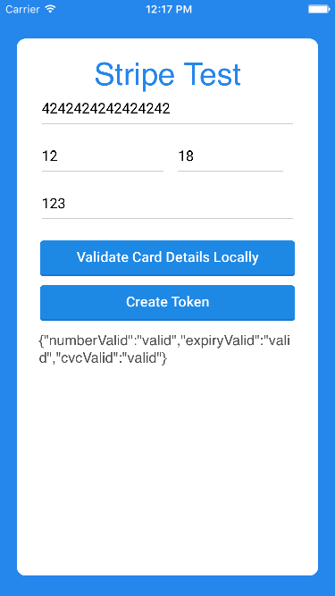

# Fuse.Stripe

This little package let's you create payment tokens and validate card details using Stripe.

# Getting Going

Is really fast, just do the following:

- Reference the Stripe project in your `unoproj` file
- Whilst you are in the `unoproj` file also add this `"Stripe": { "PublishableKey": "<YourKey>" },`
- Add this to your JS `var Stripe = require("Stripe");`

Stripe's functionality is provided though `Gradle` on Android & `CocoaPods` on iOS. So when you build you have to declare that you want to use those systems:

- For Android: `uno build -tAndroid -DGradle -r`
- For iOS: `uno build -iOS -DCocoaPods -r`

Done!

# API

It's Tiny!

## createToken

Take some card details in the format

```
var cardParams = {
	"number": cardNumber.value,
	"exp_month": expiryMonth.value,
	"exp_year": expiryYear.value,
	"cvc": cvc.value
};
```

And call `Stripe.createToken(cardParams)`. This returns a promise of a Stripe `token`. See the [example](./Examples/CreateTokenExample/MainView.js) for more.

## validateCard

Take some card details, once again in this format

```
var cardParams = {
	"number": cardNumber.value,
	"exp_month": expiryMonth.value,
	"exp_year": expiryYear.value,
	"cvc": cvc.value
};
```

And call `Stripe.validateCard(cardParams)`. This returns a promise of a 'validation report'.

The 'validation report' looks like this:

```
{
	"cvcValid": "valid",
	"expiryValid": "valid",
	"numberValid": "valid"
}
```

The values for the 3 keys can be one of the following: `valid`, `invalid` or `incomplete`

`incomplete` means that the value look like it could be valid, but it is missing some characters.

See the [example](./Examples/CreateTokenExample/MainView.js) for more.

## How do I use these tokens?

The beauty of Stripe is how it relieves you from handle sensitive data on your backend. When you have the token you pass it to your own backend and then communicate with Stripe via their API. For all the details, see their [excellent documentation here](https://stripe.com/docs)

The token we provide has a bunch of info but the important bit you need on your server is the `id`. So you can choose how much of the token we provide you want to send.

## How are the tokens formatted?

Like this:

```
{
	"id": stringHere, // this is the important bit :)
	"object": "token",
	"client_ip": null,
	"created": "DateTime in UTC time in ISO-8601 format",
	"livemode": booleanHere,
	"type": stringOrNullHere,
	"used": booleanHere,
	"card": {
		"number": "Available on Android, Deprecated On iOS",
		"cvc": "Available on Android, Deprecated On iOS",
		"expmonth": stringHere,
		"expyear": stringHere,
		"name": stringOrNullHere,
		"addressline1": stringOrNullHere,
		"addressline2": stringOrNullHere,
		"addresscity": stringOrNullHere,
		"addresszip": stringOrNullHere,
		"addressstate": stringOrNullHere,
		"addresscountry": stringOrNullHere,
		"currency": stringOrNullHere,
		"last4": stringHere,
		"type": "Available on Android, Deprecated On iOS",
		"brand": stringHere,
		"fingerprint": "Available on Android, Deprecated On iOS",
		"funding": stringHere,
		"country": stringHere
	}
}
```

Here is an example of a token created using on of the test cards:

```
{
	"id": "tok_11ogsCGr50gAZQqqVjSAlJL8",
	"object": "token",
	"client_ip": null,
	"created": "2017-02-02T09:27:31Z",
	"livemode": false,
	"type": null,
	"used": false,
	"card": {
		"number": "Deprecated On iOS",
		"cvc": "Deprecated On iOS",
		"expmonth": 12,
		"expyear": 2018,
		"name": null,
		"addressline1": null,
		"addressline2": null,
		"addresscity": null,
		"addresszip": null,
		"addressstate": null,
		"addresscountry": null,
		"currency": null,
		"last4": "4242",
		"type": "Deprecated On iOS",
		"brand": "Visa",
		"fingerprint": "Deprecated On iOS",
		"funding": "Credit",
		"country": "US"
	}
}
```

## Obligatory Pic!


